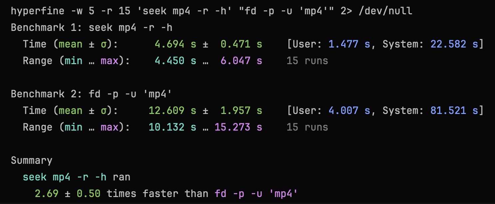

# Seek

Seek is a cross-platform command-line file searcher built as a faster alternative to `find`.

It uses a concurrent worklist algorithm that is orders of magnitude faster than conventional file-tree walks. There are no indexes. No daemons. No warm-up ritual. Just point it at a directory and let it rip.

## Why Seek

- Searches full paths, not just filenames.
- Supports both plain substring search and regex.
- Works well for source trees, logs, monorepos, and large developer workspaces.
- Ships as a clean `.NET` global tool.

Seek is for developers, power users, and anyone tired of waiting on filesystem search.

## Benchmark

A real-world full-path regex benchmark for mp4 paths under the root directory showed Seek running 2.5-3.5x faster than rust-based [fd](https://github.com/sharkdp/fd):



## Tech Stack

- C# on .NET 10
- Console UI by [PrettyConsole](https://github.com/dusrdev/PrettyConsole/)
- CLI and argument parsing by [ConsoleAppFramework](https://github.com/Cysharp/ConsoleAppFramework)

## Install

From NuGet:

```bash
dotnet tool install --global Seek
```

On supported runtimes, NuGet will resolve Seek's native AOT runtime package for the current machine automatically. A framework-dependent `Seek.any` fallback package is also published for unsupported or generic environments.

Precompiled binaries are also available in GitHub Releases.

## Agent Skill

This repo includes a reusable agent skill for path search with `seek`:

- Skill path: `.agents/skills/seek-file-search`

The bundled metadata is directly usable by Codex and other agents that understand the same skill layout. For agents that use a different schema, the skill content can still be copied and adapted.

To install it into a global skills folder, copy that directory into your agent skills directory, for example:

```bash
cp -R .agents/skills/seek-file-search ~/.agents/skills/seek-file-search
```

The skill guides agents to prefer `seek` for filesystem path lookup instead of `find`, `fd`, or `ls | grep`, and to use `rg` only for file-content search. Cursor, Claude, and other agents with different skill formats will require user-side customization for now.

## Usage

The positional argument is the search query.

By default, Seek matches against the path relative to `--root` and prints results relative to that root.

Search from the current directory:

```bash
seek report
```

Search from a specific root:

```bash
seek report --root /path/to/root
```

Example output:

```text
src/Seek.Cli/Program.cs
tests/Seek.Core.Tests/FileSystemSearchTests.cs
```

Emit absolute paths instead:

```bash
seek report --root /path/to/root --absolute
```

Regex search:

```bash
seek ".*\\.cs$" --regex
```

Only files:

```bash
seek report --files
```

Only directories:

```bash
seek report --directories
```

Short flags:

```bash
seek report -f
seek report -d
```

Machine-readable output for piping:

```bash
seek report --null | xargs -0 rm
```

`--null` always emits plain absolute paths terminated by `\0`, so it is safe for piping even when names contain spaces or newlines.

Built-in delete command:

```bash
seek delete report
seek delete report --apply
seek delete ".*\\.tmp$" --regex --apply
```

`seek delete` uses the same search-selection options as the default search command: `--regex`, `--case-sensitive`, `--hidden`, `--system`, `--files`, `--directories`, and `--root`.

Without `--apply`, `seek delete` prints the final candidate list and a `No changes were made...` hint. With `--apply`, it deletes each candidate sequentially and prints a `SUCCESS` or `FAIL` status line for each path.

Other useful options:

- `--case-sensitive`
- `-a, --absolute` to emit absolute paths instead of root-relative paths
- `-f, --files` to emit only file matches
- `-d, --directories` to emit only directory matches
- `--plain` for plain paths without ANSI escape sequences
- `--null` for NUL-terminated absolute paths that are safe to pipe into tools like `xargs -0`
- `seek delete ... --apply` for built-in deletion after preview
- `-h, --hidden` to include hidden files
- `-s, --system` to include system files
- `--highlight-color Yellow`

## Build From Source

```bash
dotnet build Seek.slnx
```
